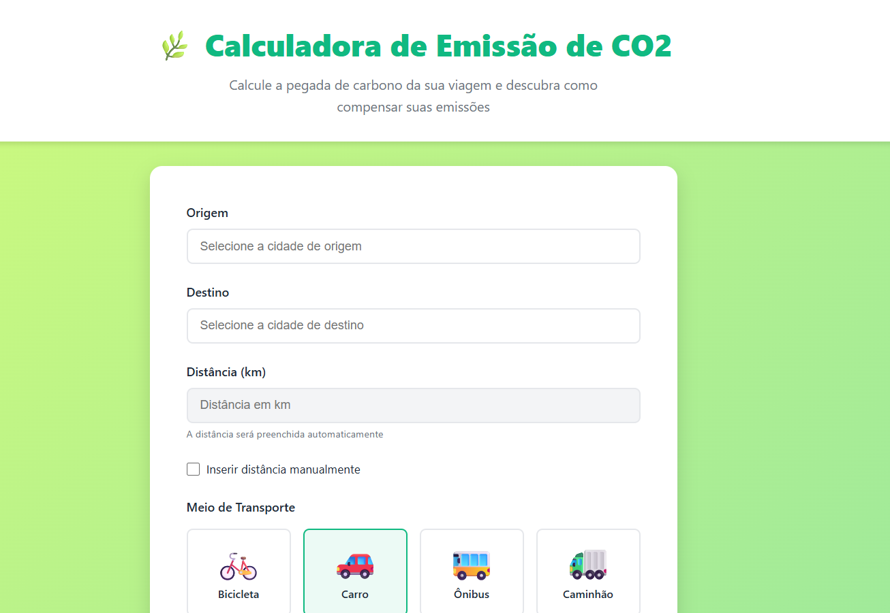

# 🌿 Calculadora de Emissão de CO2

<div align="center">


**Calcule a pegada de carbono da sua viagem e descubra como compensar suas emissões.**

[Demo](#-como-executar) · [Funcionalidades](#-funcionalidades) · [Arquitetura](#-arquitetura) · [Contribuir](#-contribuindo)

</div>

---

## 📖 Sobre o Projeto

A **Calculadora de Emissão de CO2** é uma aplicação web educacional que permite ao usuário calcular a quantidade de dióxido de carbono emitida em viagens rodoviárias entre cidades brasileiras. A ferramenta compara diferentes meios de transporte e apresenta informações sobre créditos de carbono para compensação ambiental.

> Projeto desenvolvido durante o Bootcamp **GitHub Copilot** da [Digital Innovation One (DIO)](https://www.dio.me/).

---

## ✨ Funcionalidades

- 🗺️ **Autocomplete de cidades** — banco de dados com 40+ rotas rodoviárias brasileiras
- 📏 **Preenchimento automático de distância** — ao selecionar origem e destino
- ✏️ **Entrada manual de distância** — para rotas não cadastradas
- 🚗 **4 modos de transporte** — Bicicleta, Carro, Ônibus e Caminhão
- 📊 **Resultado de emissão** — exibido em kg de CO2
- 🔄 **Comparação entre transportes** — com barras de progresso coloridas por nível de impacto
- 💚 **Créditos de carbono** — cálculo de compensação com estimativa de preço em R$
- 📱 **Design responsivo** — adaptado para mobile e desktop

---

## 🖥️ Preview
**[Link para o Preview](https://samilisbrito.github.io/carbon-calculator/)**


---

## 🏗️ Arquitetura

O projeto segue uma arquitetura **vanilla** sem frameworks, com separação clara de responsabilidades:

```
carbon-calculator/
├── index.html              # Estrutura HTML5 + carregamento dos scripts
├── css/
│   └── style.css           # Design system completo (tokens, componentes, responsividade)
├── js/
│   ├── routes-data.js      # ⭐ RoutesDB — banco de 40+ rotas rodoviárias brasileiras
│   ├── config.js           # CONFIG — fatores de emissão CO2, metadados UI, setup do DOM
│   ├── calculator.js       # Calculator — lógica de cálculos e conversões
│   ├── ui.js               # UI — renderização dinâmica de HTML e utilitários DOM
│   └── app.js              # Inicialização, eventos e orquestração dos módulos
└── README.md
```

### Objetos Globais

| Objeto | Arquivo | Responsabilidade |
|---|---|---|
| `RoutesDB` | `routes-data.js` | Banco de rotas, `getAllCities()`, `findDistance()` |
| `CONFIG` | `config.js` | Fatores CO2, metadados UI, `populateDatalist()`, `setupDistanceAutofill()` |
| `Calculator` | `calculator.js` | `calculateEmission()`, `calculateAllModes()`, `calculateSavings()`, créditos |
| `UI` | `ui.js` | `renderResults()`, `renderComparison()`, `renderCarbonCredits()`, utilitários |

### Ordem de Carregamento dos Scripts

```html
<script src="js/routes-data.js"></script>   <!-- 1º: Dados (sem dependências) -->
<script src="js/config.js"></script>         <!-- 2º: Depende de RoutesDB -->
<script src="js/calculator.js"></script>     <!-- 3º: Depende de CONFIG -->
<script src="js/ui.js"></script>             <!-- 4º: Depende de CONFIG -->
<script src="js/app.js"></script>            <!-- 5º: Orquestra tudo -->
```

---

## 🔬 Fatores de Emissão Utilizados

| Transporte | Emissão (kg CO2/km) | Impacto |
|---|---|---|
| 🚲 Bicicleta | `0` | Nenhum |
| 🚌 Ônibus | `0.089` | Baixo |
| 🚗 Carro | `0.12` | Médio |
| 🚚 Caminhão | `0.96` | Alto |

> Valores baseados em médias estimadas para o contexto brasileiro.

---

## 🗺️ Cobertura de Rotas

O banco de dados cobre as **5 regiões do Brasil** com 40 rotas:

| Região | Exemplos |
|---|---|
| **Sudeste** | SP↔RJ (430km), SP↔Campinas (95km), RJ↔Niterói (13km) |
| **Sul** | SP↔Curitiba (408km), Curitiba↔Floripa (300km) |
| **Centro-Oeste** | SP↔Brasília (1015km), Brasília↔Goiânia (209km) |
| **Nordeste** | Salvador↔Recife (839km), Fortaleza↔Natal (537km) |
| **Norte** | São Luís↔Belém (806km), Belém↔Manaus (5298km) |

> Para rotas não cadastradas, utilize a opção **"Inserir distância manualmente"**.

---

## 🎨 Design System

- **Paleta eco-friendly**: verde esmeralda (`#10b981`) como cor primária
- **Background**: gradiente `#d4fc79 → #96e6a1`
- **Tipografia**: fontes do sistema (`-apple-system`, `Segoe UI`, `Roboto`)
- **Metodologia CSS**: BEM (Block Element Modifier)
- **Animações**: `fadeIn` nas seções de resultado, `spin` no loading
- **Responsividade**: breakpoints em `767px` (mobile) e `768px` (desktop)

---

## 🚀 Como Executar

Por ser uma aplicação **100% front-end sem dependências**, basta abrir o arquivo no navegador:

```bash
# Clone o repositório
git clone https://github.com/SamilisBrito/carbon-calculator.git

# Entre na pasta
cd carbon-calculator

# Abra no navegador (duplo clique no arquivo)
# Ou use um servidor local como o Live Server (VS Code)
```

> ⚠️ Recomenda-se usar um servidor local (ex: Live Server do VS Code) para evitar restrições de CORS em alguns navegadores.

---

## 🧪 Testando os Módulos no Console

Com a página aberta, você pode testar os módulos diretamente no console do navegador:

```javascript
// Listar todas as cidades disponíveis
RoutesDB.getAllCities()

// Buscar distância entre duas cidades (bidirecional)
RoutesDB.findDistance("São Paulo, SP", "Rio de Janeiro, RJ") // → 430

// Calcular emissão: 430km de carro
Calculator.calculateEmission(430, 'car') // → 51.6

// Comparar todos os modos para 430km
Calculator.calculateAllModes(430)

// Calcular créditos de carbono
Calculator.calculateCarbonCredits(51.6) // → 0.0516

// Estimar preço dos créditos
Calculator.estimateCreditPrice(0.0516)
```

---

## 📁 Convenções de Código

- **BEM** para todas as classes CSS (`.form__group`, `.results__card--savings`)
- **`var`** em vez de `let`/`const` para máxima compatibilidade
- **Objetos globais** sem módulos ES6 (carregamento via `<script>`)
- **Comentários JSDoc** em todos os métodos públicos
- **Separadores visuais** (`// ===`) entre seções nos arquivos JS

---

## 🤝 Contribuindo

1. Faça um fork do projeto
2. Crie uma branch: `git checkout -b feature/minha-feature`
3. Commit suas mudanças: `git commit -m 'feat: adiciona nova funcionalidade'`
4. Push para a branch: `git push origin feature/minha-feature`
5. Abra um Pull Request

---

## 📝 Licença

Distribuído sob a licença MIT. Veja `LICENSE` para mais informações.

---

<div align="center">

Desenvolvido com 💚 por **Samilis** para a [DIO](https://www.dio.me/) | Bootcamp GitHub Copilot

</div>
